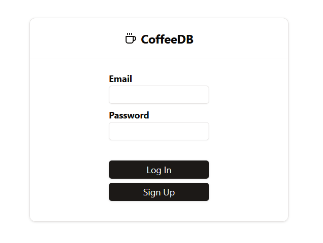
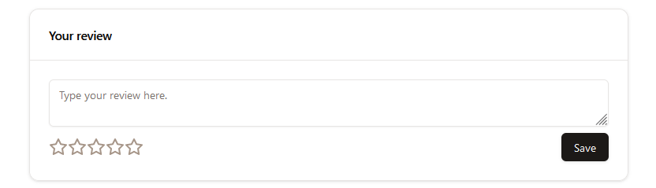
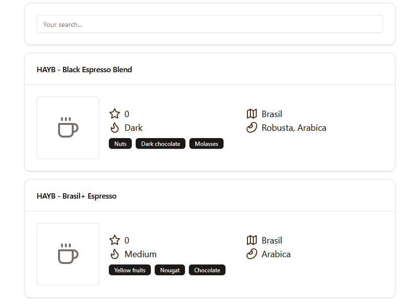
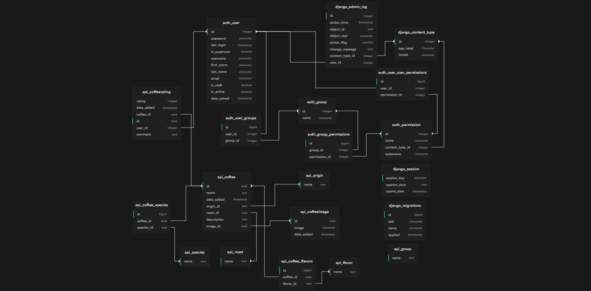

# CoffeeDB

## Description

Web app for rating and discovering coffee.

## Running the app

### Database

The app requires an external PostgreSQL database. The connection string should be configured in `.env` file in the `backend/` directory.

`.env` file format:

```env
PASSWORD=
HOST=
PORT=
USER=
```

### Backend

To run the backend, navigate to the `backend/` directory and run:

```bash
pip install -r requirements.txt
python manage.py migrate
python manage.py runserver
```

### Frontend

To run the frontend, navigate to the `frontend/` directory and run:

```bash
npm install
npm run dev
```

## Functionalities

-   User authentication



-   Rating and reviewing coffee



-   Searching



-   Adding coffee

## Stack

### Frontend

-   React
-   Vite
-   TailwindCSS
-   shadcn/ui (UI library)

### Backend

-   Django
-   Django REST Framework
-   PostgreSQL

### Stack rationale

-   React is a popular frontend framework that I have experience with. It also has a very large ecosystem of libraries and tools.
-   Vite is a new frontend build tool that is very fast and modern.
-   TailwindCSS is a utility-first CSS framework that is very customizable and easy to use. It doesn't require tinkering with components to achieve the desired look.
-   shadcn/ui is a UI library that provides a set of good looking components that are freely customizable and are based on TailwindCSS.

-   Django is a popular backend framework with rich support and many additional libraries. It also allows for quick development by providing a lot of functionality out of the box.
-   Django REST Framework is a library that provides tools for building REST APIs. It's built on top of Django and provides all the necessary tools for building a REST API.
-   PostgreSQL is a popular relational database that is very fast, open source, reliable and robust, it also has a very good documentation.

## ERD Diagram


